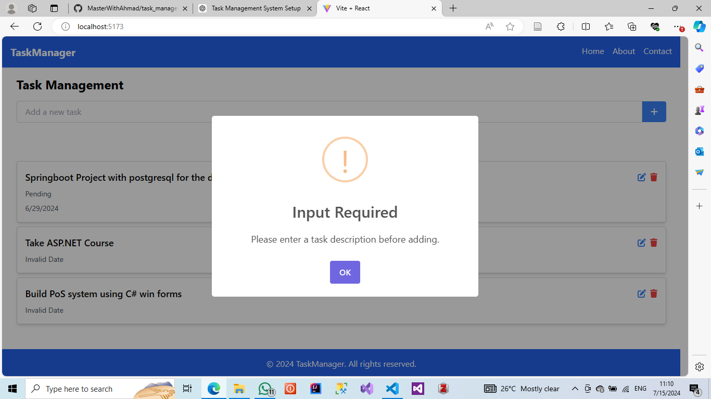

# Task Management System

A web-based task management application built with React.js and Tailwind CSS for styling, utilizing SweetAlert for notifications. This app allows users to create, read, update, and delete tasks with a professional and intuitive interface. Tasks can be managed efficiently with features like search functionality and detailed task views.

## Features

- **Routing**: Managed with React Router DOM for seamless navigation.
- **State Management**: Utilizes React hooks (`useState`, `useEffect`, `useContext`) for efficient state management.
- **Dynamic Data**: Integrates with local storage to persist tasks between sessions.
- **Form Handling**: Includes forms for adding and editing tasks with validation.
- **Styling**: Enhanced UI using Tailwind CSS.
- **Notifications**: SweetAlert for user feedback on actions like adding, editing, and deleting tasks.
- **Task Details**: Dedicated page for detailed task information.
- **Search Functionality**: Allows users to search tasks efficiently.
- **Professional Pages**: Includes About and Contact pages.

## Screenshots

### Home Page

### About Page


### Contact Page


### Success Notification


### Error Notification


### Confirmation Notification


## Getting Started

### Prerequisites

- Node.js and npm installed on your machine.

### Installation

1. **Clone the repository**:
    ```sh
    git clone https://github.com/your-username/task-management-system.git
    ```

2. **Navigate to the project directory**:
    ```sh
    cd task-management-system
    ```

3. **Install dependencies**:
    ```sh
    npm install
    ```

4. **Run the application**:
    ```sh
    npm start
    ```

## Usage

- **Add Task**: Use the input field on the home page to add new tasks.
- **Edit Task**: Click the edit icon next to a task to open the edit modal.
- **Delete Task**: Click the delete icon next to a task to remove it.
- **Search Tasks**: Use the search bar to filter tasks by name or status.
- **Navigate**: Use the header to navigate between Home, About, and Contact pages.

## Contributing

Contributions are welcome! Please fork this repository and submit a pull request for any changes.

## License

This project is licensed under the MIT License.

## Contact

For any inquiries, please contact [ahmad.eyhash@gmail.com].

---

